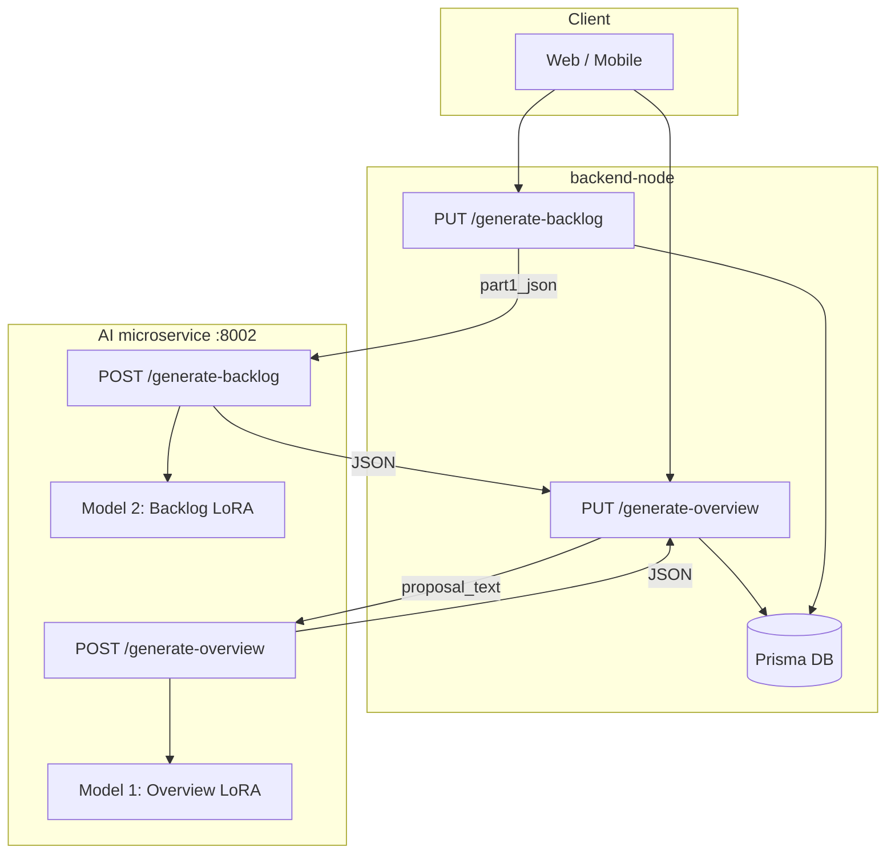

# AI Microservice (FastAPI)

Stateless LLM service for overview and backlog generation. Called by backend-node.

## How the microservice works

The AI layer has two entry points: an **HTTP API** (used by backend-node) and **CLI scripts** (notebook-parity, for local use). Both produce the same kinds of outputs; the HTTP API returns JSON directly, while the CLIs output plain text and optionally parsed JSON.

### High-level flow

```
┌─────────────────┐     proposal_text      ┌──────────────────┐     JSON      ┌─────────────────┐
│  backend-node   │ ───────────────────►  │  AI microservice │ ───────────►  │  backend-node   │
│  (Express)      │  POST /generate-*      │  (FastAPI:8002)  │               │  save*ToDb()    │
└─────────────────┘                        └──────────────────┘               └─────────────────┘
        │                                            │
        │ 1. Fetch proposal from Prisma               │ 2. Load PEFT adapter, run inference
        │ 2. callAIService(endpoint, body)            │ 3. Return structured JSON
        │ 3. Persist to Prisma                        │
        └────────────────────────────────────────────┘
```

### Overview generation flow

1. **Trigger**: User runs "Generate Overview" (or backend calls `PUT /api/ai/projects/:id/generate-overview/`).
2. **Input**: Backend fetches the latest proposal `parsed_text` from Prisma.
3. **AI call**: `POST /generate-overview` with `{ proposal_text }`.
4. **Model**: Qwen2-1.5B + LoRA adapter `qwen_model1_overview_lora_1p5b` (Model 1).
5. **Output**: JSON with `title`, `summary`, `features`, `roles`, `goals`, `timeline`. Plain text is passed through `normalize_overview_glued_headers` in `generated_parsers.py` when the model omits a line break before the next header (e.g. `Frontend DeveloperFeatures:`), so section extraction does not swallow the rest of the document into `roles`.
6. **Model 1 roles fallback**: If parsed `Roles` do not cover PM / backend / frontend (keywords: *project* / *product manager* / *program manager* / word *pm*, *backend*, *frontend*), missing defaults are appended: Project Manager, Backend Developer, Frontend Developer. Set `OVERVIEW_DISABLE_ROLE_BACKFILL=1` to disable. (Implementation uses a multiline-safe regex `[\s\S]*?` for the Roles block—plain `.*?` does not cross newlines, so bullet lists previously skipped backfill entirely.)
7. **Persistence**: Backend calls `saveOverviewToDb()` → Prisma (`ai_api_project`, `ai_api_projectfeature`, `ai_api_projectrole`, `ai_api_projectgoal`, `ai_api_timelineweek`, `ai_api_timelineitem`).

### Backlog generation flow

1. **Trigger**: User runs "Generate Backlog" (or backend calls `PUT /api/ai/projects/:id/generate-backlog/`).
2. **Input**: Backend first calls `/generate-overview` to get the overview, then builds `part1_json` (summary, roles, features, goals, timeline as `week1`…`week4`).
3. **AI call**: `POST /generate-backlog` with `{ part1_json }`.
4. **Model**: Qwen2-1.5B + LoRA adapter `qwen_model2_backlog_lora_1p5b` (Model 2).
5. **Output**: JSON with `epics` → `sub_epics` → `user_stories` → `tasks`.
6. **Persistence**: Backend calls `saveBacklogToDb()` → Prisma (`ai_api_epic`, `ai_api_subepic`, `ai_api_userstory`, `ai_api_storytask`).

### Two pipelines

| Path | Entry | Models | Use case |
|------|-------|--------|----------|
| **HTTP API** | `main.py` → `/generate-overview`, `/generate-backlog` | `notebook_step_inference` + `generated_parsers` (same LoRA adapters as CLI) | Production; called by backend-node |
| **CLI** | `project_overview.py`, `project_backlog.py` | Same `notebook_step_inference` stack | Local runs, notebook-parity, debugging |

The CLI and HTTP routers share the notebook-parity inference module (`notebook_step_inference.py`) and parsers. **`test_microservice.py`** (default batch) runs **all overviews** with Model 1 loaded once, then **all backlogs** with Model 2 loaded once—**two** full “Loading weights” sequences total for the whole run (not per proposal). A single proposal+backlog pair still uses the same unload-between-overview-and-backlog pattern.

**Contract smoke (no GPU):** `python smoke_parser_contracts.py` — checks overview/backlog parser shapes and Node `part1_json` round-trip via `part1_json_string_to_overview_dict`.

### Data flow (mermaid)



## Run

With venv activated, use `python -m uvicorn` so the venv's Python (and its torch) is used:

```bash
.venv\Scripts\activate
cd AI
python -m uvicorn main:app --port 8002 --reload
```

## CLI Scripts (Notebook-Parity Generation)

Two CLI entrypoints run Model 1 (overview) and Model 2 (backlog) inference with notebook-parity logic. **Strategy B only by default**; C-fallback and backlog retry are gated by env vars or flags.

### project_overview.py

Generates project overview from a raw proposal. Input: proposal text. Output: overview text (Title/Summary/Roles/Features/Goals/Timeline).

```bash
# From repo root
python AI/project_overview.py --proposal proposal.txt
python AI/project_overview.py --proposal proposal.txt -o overview.txt --json-out overview.json
python AI/project_overview.py --proposal -  # read proposal from stdin
```

| Arg | Description |
|-----|-------------|
| `--proposal` | Path to proposal file, or `-` for stdin |
| `--output`, `-o` | Write overview text to file (default: stdout) |
| `--json-out` | Write parsed JSON to file |
| `--enable-c-fallback` | Enable C-strategy fallback when B fails quality gate |
| `--device` | Reserved for future device override |

### project_backlog.py

Generates backlog from Model 1 overview text. **Input is not raw proposal** — it must be the overview output (Title/Summary/Roles/Features/Goals/Timeline).

```bash
python AI/project_backlog.py --part1 overview.txt
python AI/project_backlog.py --part1 overview.txt -o backlog.txt --json-out backlog.json
```

| Arg | Description |
|-----|-------------|
| `--part1` | Path to Model 1 overview text file |
| `--output`, `-o` | Write backlog text to file (default: stdout) |
| `--json-out` | Write parsed JSON to file |
| `--enable-retry` | Enable retry when B output fails structure validation |

### Environment Variables

| Variable | Default | Description |
|----------|---------|-------------|
| `PEFT_ADAPTER_PATH` | `llms/fine_tune/qwen_model1_overview_lora_1p5b` | Overview adapter path (relative to AI root) |
| `PEFT_ADAPTER_PATH_BACKLOG` | `llms/fine_tune/qwen_model2_backlog_lora_1p5b` | Backlog adapter path |
| `OVERVIEW_ENABLE_C_FALLBACK` | `0` | Set `1` to enable C-fallback for overview |
| `BACKLOG_ENABLE_RETRY` | `1` | Set `0` to disable retry for backlog |
| `BACKLOG_PROMPT_MODE` | `minimal_strict` | Model 2 prompt shape in `notebook_step_inference.generate_backlog_from_part1`: `minimal_strict` (default, matches Step 6), `training_exact` (Part 1 + newline only), or `legacy` (long guided prefix + `Input:`/`Backlog:`). Invalid values fall back to `minimal_strict`. |
| `BACKLOG_USE_TRAINING_PART1_FORMAT` | `1` | Convert overview to dataset prompt format (`=== Title ===`, unbulleted) before Model 2; set `0` to pass raw text |

`.env` is loaded from `AI/` and project root (same as `main.py`).

### Model 2 input format

Model 2 was fine-tuned on `model2_part1_to_backlog_epic_v1.jsonl`, where each `prompt` uses a canonical layout:

- `=== {title} ===` (not `Title: ...`)
- `Summary:\n{paragraph}\n`
- `Roles:\n` and `Features:\n` / `Goals:\n` with **one item per line, no bullets**
- `Timeline:\nWeek N: task1, task2`

When `BACKLOG_USE_TRAINING_PART1_FORMAT=1`, overview text (or parsed JSON from API/DB) is converted via `overview_dict_to_model2_training_prompt` before being fed to Model 2. This aligns inference with the training distribution.

### Model 2: training vs inference prompt (LoRA / notebook Step 6)

Fine-tuning builds each example as `full_text = prompt + "\n" + response` (see `llms/fine_tune/prepare_dataset.py`). The adapter learns to **continue** after the Part 1 `prompt` and a single newline—not after a long system-style instruction block, `Input:` / `Backlog:` wrappers, or an `END_OF_BACKLOG` suffix (those are not in the JSONL labels).

For inference in `TrainModel2_Backlog.ipynb` Step 6, set **`PROMPT_MODE`** (default **`minimal_strict`**): **Part 1 text + newline + a short strict rules block** that anchors `Epic 1:` and forbids markdown/timeline noise—small train/infer gap vs JSONL, but usually better than unconstrained decoding. Use **`training_exact`** for **Part 1 + newline only** (strict `prepare_dataset` boundary); the base model may drift into timelines or code blocks without guidance. Use **`legacy`** for the long `COMPACT_STRICT_PROMPT` + `Input:` / `Backlog:` wrapper (experiments only). Compliance scoring treats `END_OF_BACKLOG` as optional so notebook “PASS” reflects dataset-style output rather than false failures.

The **microservice** and **`project_backlog.py`** use the same minimal-strict text via [`backlog_minimal_strict_prompt.py`](backlog_minimal_strict_prompt.py) and **`BACKLOG_PROMPT_MODE`** (default **`minimal_strict`**), aligned with Step 6 decoding: base **`max_new_tokens` 420** (retry **500**) for non-legacy modes when there are **≤5 goals**; for **6+ goals**, the budget **adds** **`BACKLOG_TOKENS_PER_EPIC_OVER_5`** (default **95**) per epic over five, capped by **`BACKLOG_MAX_NEW_TOKENS_CAP`** (default **1024**). `repetition_penalty=1.18`; no `no_repeat_ngram` except in **`legacy`**. Retry does not require `END_OF_BACKLOG` except in `legacy`. **`_sanitize_backlog_response`** strips guide-echo lines (including **`Total epics:`** rule lines) and cuts off at meta phrases like “The following are some examples…”. **`_repair_backlog_flat_shape`** (post-sanitize) caps tasks per story, inserts missing **`Epic N:`** headers from parsed goals when sub-epics stack, and **truncates** extra trailing sub-epics on the final goal.

**`BACKLOG_MAX_GOALS_FED`** (default **5**): only the **first N** goals from the parsed overview are embedded in Part 1 for Model 2, matching typical JSONL length and reducing extra-epic hallucination. Set **`BACKLOG_MAX_GOALS_FED=0`** to pass **all** goals (longer backlogs, more token pressure).

**Batch backlog tuning:** [`test_microservice.py`](test_microservice.py) can run backlog-only over [`model2_part1_to_backlog_epic_v1_flat.jsonl`](llms/fine_tune/dataset/model2_part1_to_backlog_epic_v1_flat.jsonl): `python test_microservice.py --list-jsonl`, `python test_microservice.py --jsonl-indices 0,8,9`, `python test_microservice.py --jsonl-start 0 --jsonl-count 5 --show-gold`.

**Default `python test_microservice.py`:** runs **`TEST_PROPOSALS`** in that file (edit the list): for each entry, overview → backlog, writing **`test_output_overview_1..N`** and **`test_output_backlog_1..N`** (`.txt` + `.json`).

### Parser Smoke Test

Run parsers without GPU:

```bash
python AI/generated_parsers.py
```

## Windows + RTX 4050: Fix WinError 193 / cublas64_11.dll

The error means PyTorch was built for CUDA 11; your GPU (RTX 4050) needs **CUDA 12.8**. Reinstall:

```bash
pip uninstall torch -y
pip install torch --index-url https://download.pytorch.org/whl/cu128
```

Then restart the AI service.
